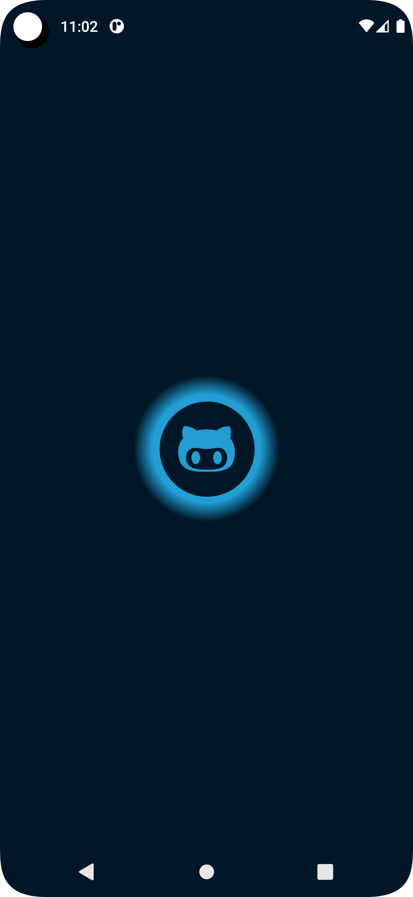
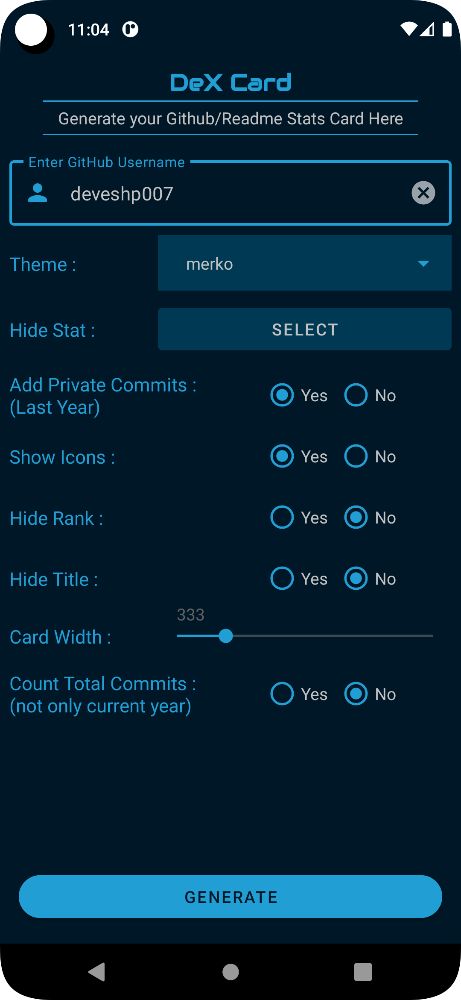
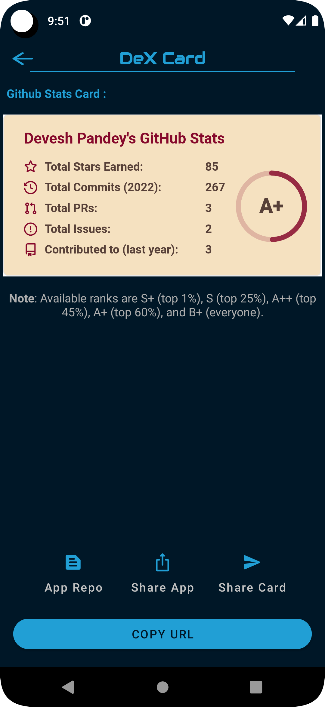

  

<h1 align="center">
  DeX Card
</h1>

  App to generate stats card for your github profile with a set of customizable options. You can also copy the link of generated card and use it in your github README. 

    
      
  
  

## Screenshots

Splash Screen|Home|Output
:-----:|:--------------:|:-----------:|
 |  | 

## Download

Go to the [Releases](https://github.com/deveshp007/DeX-Card/releases) to download.

Or directly [Download](https://github.com/deveshp007/DeX-Card/releases/download/v0.0.1-alpha/dex-card.apk) APK.

## API

For API repository (github-readme-stats) [Click Me!](https://github.com/anuraghazra/github-readme-stats) 

## Tech Stack/Features

- Tech Stacks:
  - Material Design
  - Kotlin
  - Splash-screen(using API)
  - Minimum SDK level 21

- Customizations:
  - Themes
  - Hide specific stat
  - Adding private commits
  - Hide icons
  - Hide ranks
  - ...many more.
